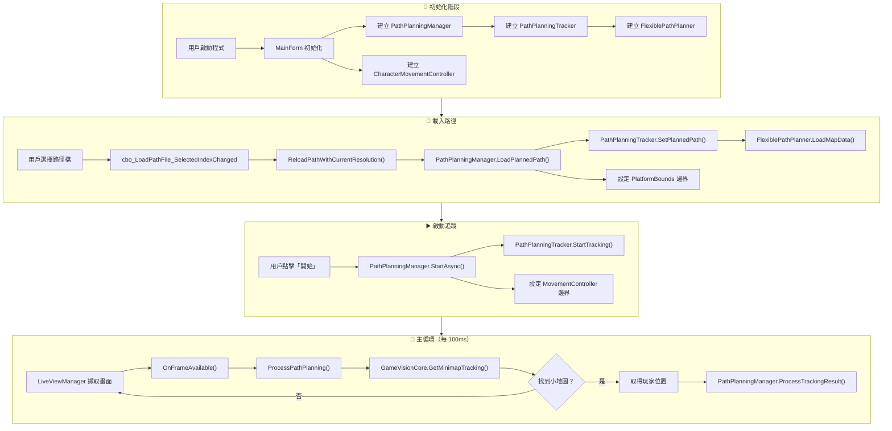
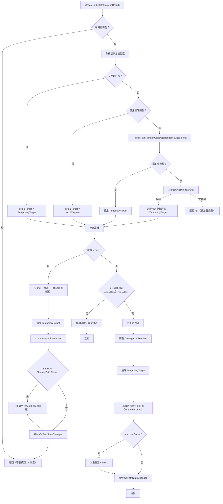
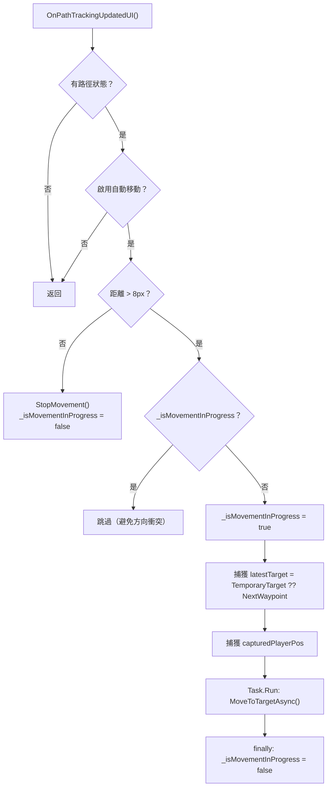
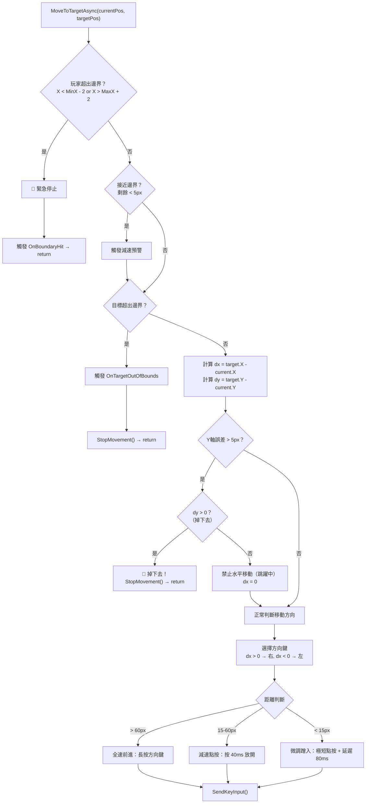
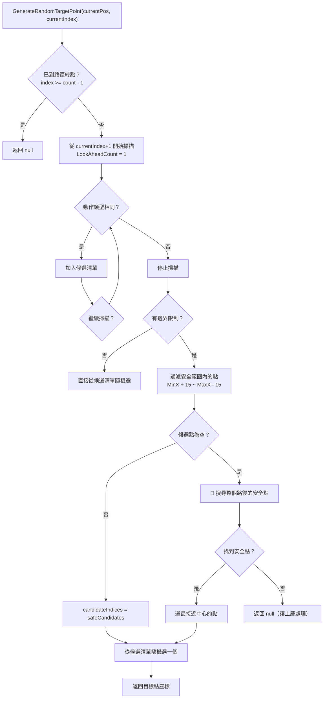
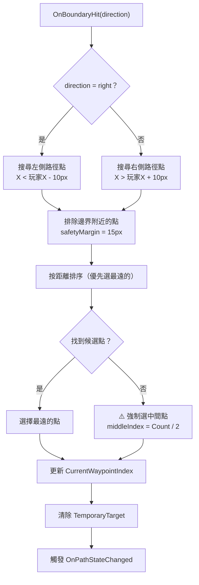

# 路徑規劃系統流程圖（修正版）

## 整體架構

---

## 核心邏輯：UpdatePathState（修正版）

---

## 移動控制：OnPathTrackingUpdatedUI（修正版）

---

## 移動控制器：MoveToTargetAsync（修正版）

---

## 靈活路徑規劃：GenerateRandomTargetPoint（修正版）

---

## 邊界處理：OnBoundaryHit（修正版）

---

## 關鍵類別職責

| 類別 | 職責 |
|------|------|
| `MainForm` | UI 控制、事件訂閱、調用移動控制器（含互斥鎖） |
| `PathPlanningManager` | 管理 Tracker 和 Controller 的協調 |
| `PathPlanningTracker` | 路徑狀態管理、到達判定、循環重置、事件觸發 |
| `FlexiblePathPlanner` | 隨機選點、邊界過濾、保底搜尋 |
| `CharacterMovementController` | 鍵盤控制、三段式煞車、Y軸鎖死、邊界保護 |
| `GameVisionCore` | 小地圖偵測、玩家位置追蹤 |

---

## 關鍵變數與 Index 推進機制

| 變數 | 所在類別 | 用途 | 推進機制 |
|------|----------|------|----------|
| `TemporaryTarget` | PathPlanningState | 臨時目標（優先於 NextWaypoint） | 到達或跳過時清除 |
| `CurrentWaypointIndex` | PathPlanningState | 當前路徑點索引 | 見下表 |
| `_isMovementInProgress` | MainForm | 防止移動任務並行執行 | 任務開始設 true，finally 設 false |
| `_platformBounds` | 多處 | 平台邊界限制 | 由 MapData 設定 |

### CurrentWaypointIndex 推進機制

| 情況 | 觸發條件 | 處理方式 |
|------|----------|----------|
| 1️⃣ 太近跳過 | `distance < 8px` | `++` 或 `FindIndex` |
| 2️⃣ 到達確認 | `X ≤ 15px 且 Y ≤ 10px` | `FindIndex` 或 `++` |
| 3️⃣ 循環重置 | `Index >= Count` | 重置至 `0` |
| 4️⃣ 邊界處理 | `OnBoundaryHit` 觸發 | 選擇反方向的點索引 |

---

## 修正對照表

| # | 修正點 | 原本問題 | 修正內容 |
|---|--------|----------|----------|
| 1 | 太近閾值 | 寫 2px | 改為 8px (WaypointReachDistance) |
| 2 | 循環重置 | 只顯示一處 | 在兩處（跳過、到達）都顯示 |
| 3 | Y 軸鎖死 | 未區分 dy 正負 | `dy > 0` 掉下去 return，`dy < 0` 禁止水平 |
| 4 | 邊界過濾 | 未顯示保底搜尋 | 加入「搜尋整個路徑」分支 |
| 5 | Index 推進 | 說明不清 | 補充四種推進情況表格 |
