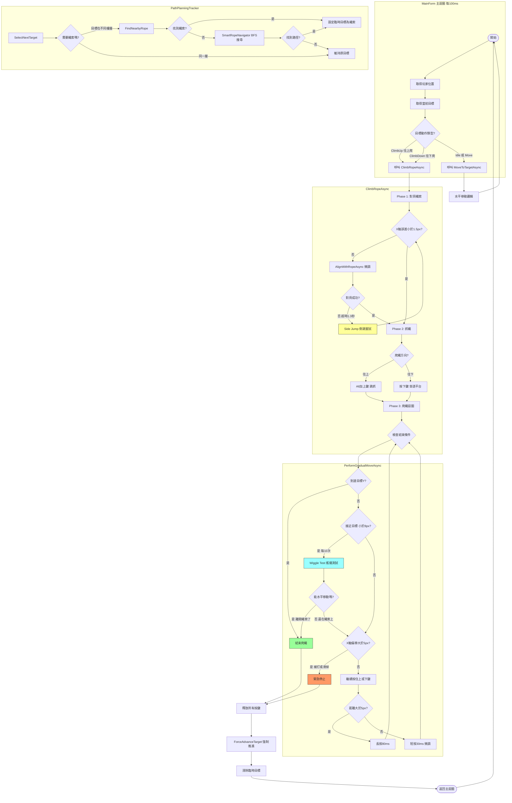

# 繩索攀爬完整機制流程圖

---

## 各機制說明

### 1. 主程式迴圈 (MainForm)
- 每 **100ms** 執行一次
- 根據 `PathActionType` 決定執行動作

### 2. 路徑規劃器 (PathPlanningTracker)
- **FindNearbyRope**: 找附近可用的繩索
- **SmartRopeNavigator**: BFS 搜尋多層繩索路徑

### 3. 對齊機制 (AlignWithRopeAsync)
- 用 **30ms 短按** 微調 X 軸位置
- 超時 **1.3秒** 觸發 **Side Jump** (跳躍+方向鍵)

### 4. 抓繩機制
- **往上**: `Alt + ↑` (跳躍抓繩)
- **往下**: `↓` (穿透平台)

### 5. 爬繩迴圈
- **長按 80ms**: 距離 > 5px
- **短按 30ms**: 距離 < 5px (微調)

### 6. 結束條件
| 條件 | 說明 |
|------|------|
| 到達目標 Y | 正常完成 |
| Wiggle Test 成功 | 確認已離開繩索站上平台 |
| X 軸偏移 > 5px | 被擊退或滑掉，緊急停止 |

### 7. 強制推進 (ForceAdvanceTarget)
- 標記當前目標完成
- **清除臨時目標** (防止鬼打牆)
- 推進到下一個路徑點
