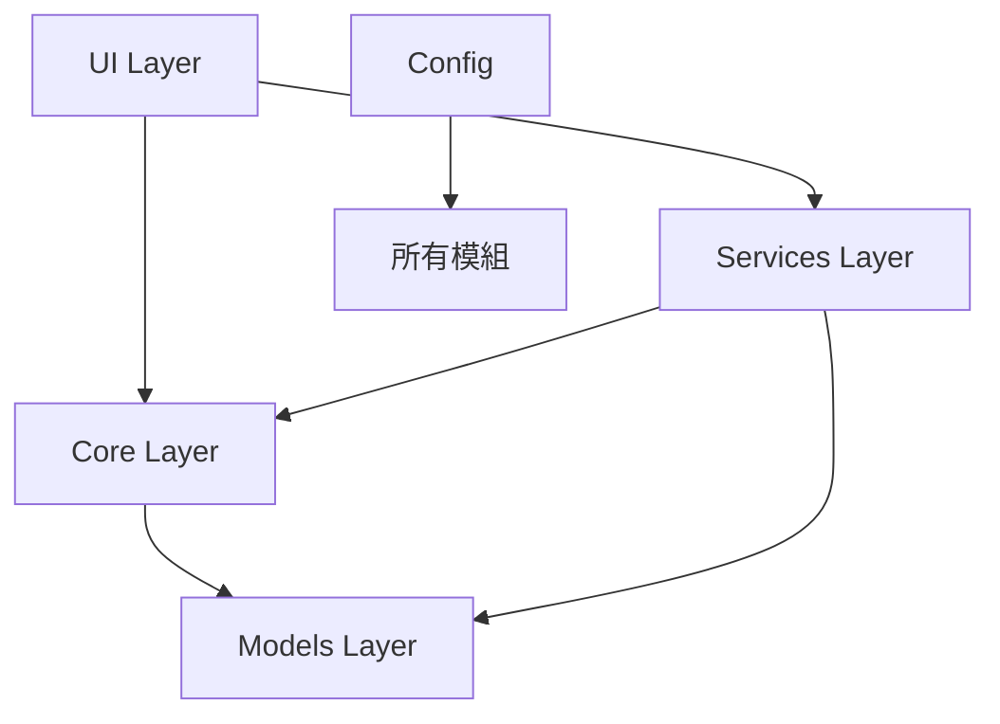

# ArtaleAI 完整程式碼審查報告

## 📊 專案概覽

| 項目 | 內容 |
|------|------|
| 專案類型 | Windows Forms 遊戲輔助工具 |
| 框架 | .NET 6.0 (Windows) |
| 主要功能 | 視窗擷取、角色追蹤、路徑規劃、自動移動 |

---

## 🏗️ 架構評估



### ✅ 優點
- **清晰的分層架構**：UI / Services / Core / Models 分離良好
- **單例模式**：`AppConfig` 使用 Singleton 管理全域設定
- **執行緒安全**：`SharedGameState` 使用「公告板模式」正確處理多執行緒
- **IDisposable 實作**：大部分需要釋放資源的類別都有正確實作

### ⚠️ 待改善
- **MainForm 過於龐大**：2200+ 行，建議拆分到 ViewModel

---

## 📁 模組審查

### 1. Config Layer

#### [AppConfig.cs](file:///d:/Full_end/C%23/ArtaleAI/Config/AppConfig.cs)
| 項目 | 評分 | 說明 |
|------|------|------|
| 設計模式 | ⭐⭐⭐⭐⭐ | Singleton + INotifyPropertyChanged |
| YAML 支援 | ⭐⭐⭐⭐⭐ | YamlDotNet 整合完善 |
| 建議 | - | 可考慮加入 Validation |

---

### 2. Core Layer

#### [SharedGameState.cs](file:///d:/Full_end/C%23/ArtaleAI/Core/SharedGameState.cs) ⭐ 優秀設計
```csharp
// 正確的執行緒安全實作
private readonly object _lock = new object();
public void UpdateState(...)
{
    lock (_lock) { ... }
}
```
✅ 適當的 Bitmap.Clone() 避免 UI 執行緒衝突

#### [GameVisionCore.cs](file:///d:/Full_end/C%23/ArtaleAI/Core/GameVisionCore.cs)
| 項目 | 評分 | 說明 |
|------|------|------|
| 功能完整性 | ⭐⭐⭐⭐⭐ | 小地圖追蹤、模板匹配 |
| 效能 | ⭐⭐⭐⭐☆ | 使用 OpenCV，可加快取 |
| 程式碼量 | ⚠️ 1035 行 | 考慮拆分為多個類別 |

#### [PathPlanningTracker.cs](file:///d:/Full_end/C%23/ArtaleAI/Core/PathPlanningTracker.cs)
- ✅ 已重構：執行緒安全 + 常數統一
- ✅ 動態判定距離 (Single Source of Truth)

---

### 3. Services Layer

#### [ScreenCapture.cs](file:///d:/Full_end/C%23/ArtaleAI/Services/ScreenCapture.cs) ⭐ 效能優化
```csharp
// 使用快取的 Staging Texture，避免每幀重新創建
private Texture2D? _cachedStagingTexture;
```
✅ 直接從 Direct3D Texture 轉 OpenCV Mat，跳過 Bitmap

#### [WindowFinder.cs](file:///d:/Full_end/C%23/ArtaleAI/Services/WindowFinder.cs)
- ✅ 多重回退機制 (Fallback)
- ✅ COM Interop 正確使用

#### [CharacterMovementController.cs](file:///d:/Full_end/C%23/ArtaleAI/Services/CharacterMovementController.cs)
| 項目 | 評分 | 說明 |
|------|------|------|
| 執行緒安全 | ⭐⭐⭐⭐☆ | 使用 CancellationToken |
| 建議 | ⚠️ | 可將 VK_xxx 常數移至 Config |

---

### 4. UI Layer

#### [MainForm.cs](file:///d:/Full_end/C%23/ArtaleAI/UI/MainForm.cs)
| 項目 | 評分 | 說明 |
|------|------|------|
| 功能 | ⭐⭐⭐⭐⭐ | 完整的 UI 整合 |
| 程式碼量 | ⚠️ 2200+ 行 | **需要拆分** |
| 建議 | - | 考慮 MVVM 或 MVP 模式 |

#### [MapEditor.cs](file:///d:/Full_end/C%23/ArtaleAI/UI/MapEditor.cs)
- ✅ 清晰的職責分離
- ✅ 支援多種編輯模式

#### [LiveViewManager.cs](file:///d:/Full_end/C%23/ArtaleAI/UI/LiveViewManager.cs)
- ✅ Timer 管理完善
- ✅ 抓取畫面分發架構良好

---

### 5. Models Layer (新重構)
- ✅ 按功能分類 (Detection, PathPlanning, Minimap, Map)
- ✅ record 類型用於不可變資料
- ✅ 統一的 JSON 序列化輔助類別

---

### 6. Utils Layer

| 檔案 | 評分 | 說明 |
|------|------|------|
| Logger.cs | ⭐⭐⭐⭐⭐ | Serilog 整合 |
| MsgLog.cs | ⭐⭐⭐⭐☆ | UI 日誌輔助 |
| DrawingHelper.cs | ⭐⭐⭐⭐☆ | GDI+ 封裝 |
| PathManager.cs | ⭐⭐⭐⭐⭐ | 路徑管理 |

---

## 🔧 建議改善項目

### 高優先
1. **拆分 MainForm.cs**
   - 目前 2200+ 行太長
   - 建議移出：路徑規劃邏輯 → ViewModel、事件處理 → Controller

2. **拆分 GameVisionCore.cs**
   - 目前 1035 行
   - 建議移出：小地圖檢測 → MinimapDetector、怪物檢測 → MonsterDetector

### 中優先
3. **統一錯誤處理**
   - 目前 try-catch 分散各處
   - 建議：建立統一的 ErrorHandler 類別

4. **加入單元測試**
   - 目前缺乏測試
   - 建議：為 Core 和 Services 層加入 xUnit 測試

### 低優先
5. **Config 驗證**
   - 加入 FluentValidation 驗證設定值

6. **依賴注入**
   - 考慮使用 Microsoft.Extensions.DependencyInjection

---

## 📈 總評

| 面向 | 評分 | 說明 |
|------|------|------|
| **架構設計** | ⭐⭐⭐⭐☆ | 分層清晰，但部分類別過大 |
| **程式碼品質** | ⭐⭐⭐⭐☆ | XML 文件完整，命名規範 |
| **執行緒安全** | ⭐⭐⭐⭐⭐ | 正確使用 lock 和 volatile |
| **效能** | ⭐⭐⭐⭐⭐ | GPU 加速、快取優化 |
| **可維護性** | ⭐⭐⭐☆☆ | 需拆分大型檔案 |
| **測試覆蓋率** | ⭐☆☆☆☆ | 缺乏自動化測試 |

**整體評分：4.0 / 5.0** ⭐⭐⭐⭐

> 這是一個功能完整、設計良好的專案。主要改善方向是拆分大型類別和加入自動化測試。
